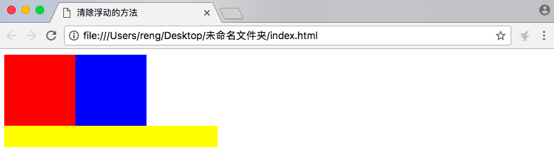

## css中清除浮动的方法

### 前言

浮动对页面的影响：

如果一个父盒子中有一个子盒子，并且子盒子没有设置高，子盒子在父盒子中进行浮动，那么将来父盒子的高度为0，由于父盒子的高度为0，下面的元素会自动补位，所以这个时候有必要进行浮动的清除。

原代码

```html

<!DOCTYPE html>
<html>
<head>
	<title>清除浮动的方法</title>
	<style type="text/css">
        .outer{
			background: #999;
		}
		.red{
			width:100px;
			height: 100px;
			background:red;
		}
		.blue{
			width:100px;
			height:100px;
			background: blue;
		}
		.other{
			width:300px;
			height: 30px;
			background:yellow;
		}
	</style>
</head>
<body>
	<div class="outer">
		<div class="red"></div>
		<div class="blue"></div>
	</div>
	<div class="other"></div>
</body>
</html>

```

愿效果：


为红色和绿色方块添加左浮动后

原代码

```html

<!DOCTYPE html>
<html>
<head>
	<title>清除浮动的方法</title>
	<style type="text/css">
		.outer{
			background: #999;
		}
		.red{
			float: left;
			width:100px;
			height: 100px;
			background:red;
		}
		.blue{
			float: left;
			width:100px;
			height:100px;
			background: blue;
		}
		.other{
			width:300px;
			height: 30px;
			background:yellow;
		}
	</style>
</head>
<body>
	<div class="outer">
		<div class="red"></div>
		<div class="blue"></div>
	</div>
	<div class="other"></div>
</body>
</html>

```

其效果为--


### 方法一：使用overflow属性来清除浮动

```bash

.outer{
    overflow:hidden;
}

```

先找到浮动盒子的父元素（盒子），在父元素中田间一个属性`overflow:hidden`，就是清除这个父元素中的子元素浮动对页面的影响。

效果如下：


**注意：**一般情况下不会使用这种方式，因为`overfloat:hidden`有一个特点，离开了这个元素所在的区域之后会被隐藏（overflow:hidden会将超出的部分隐藏起来）。


### 方法二：使用额外的标签

我在outer 类的元素下添加标签如下：

```html

	<div class="outer">
		<div class="red"></div>
		<div class="blue"></div>
	</div>
	<div style="clear:both;"></div>
	<div class="other"></div>


```

效果如下：



