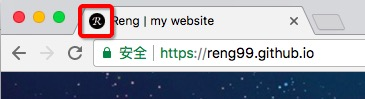

## 浏览器地址栏缩略图favicon

### 前言

favicon.ico 一般用于作为缩略的网站的标志，显示在浏览器的地址栏、浏览器标签上或者收藏夹上，是展示网站个性的浓略logo标志，也可以说是网站的头像，目前主要的浏览器都支持favicon.ico图标，如果要让网站看起来更加专业、更美、更有个性，favicon.ico是必不可少的。除了支持`.ico`后缀的图片外，还支持`.gif 和 .png`为后缀名的图片，没试过后缀名为`.jpg`的图片，如有兴趣可自行尝试哈。

### 图标大小

引用`w3c参考文章的一句话`--> `The format for the image you have chosen must be 16x16 pixels or 32x32 pixels, using either 8-bit or 24-bit colors. The format of the image must be one of PNG (a W3C standard), GIF, or ICO.`。所以我们的图标的大小最好是16*16或者32*32像素。个人认为，这种图标只是一种美化而已，不需要太大，浪费资源，也不需要太小，可能清晰度不够，所以32*32就行了。不过我在个人的网站使用了16*16像素,因为追求不高,顺便还可以优化一下网站哈 :blush: 详情点击[个人网站](https://reng99.github.io/)。截图如下：



⚠️ 之前的谷歌网站图标缓存服务器，超过16kb就不会缓存，而是直接展示默认的图标。

### 制作方法

这里介绍一个链接，可将你的图片快速的转换成后缀名为`.ico`的图片，链接为[http://www.faviconico.org/](http://www.faviconico.org/)。当然你可以自己使用ps等工具制造称为`.ico|.png|.gif`的符合实际大小的个性图标啊。


### 使用方法

根据上面说的支持的图标的后缀名，这里给出下面的使用方式：


```html

    <!--使用后缀名为.png个性小图标-->
    <html>
        <head>
            <link rel="icon" type="image/png" href="path/to/myicon.png">
                ...
        </head>
            ...
    </html>

```

```html

    <!--使用后缀名为.gif个性小图标-->
    <html>
        <head>
            <link rel="icon" type="image/gif" href="path/to/myicon.gif">
                ...
        </head>
            ...
    </html>

```

```html

    <!--使用后缀名为.ico个性小图标-->
    <html>
        <head>
            <link rel="icon" type="image/ico" href="path/to/myicon.ico">
                ...
        </head>
            ...
    </html>

```

当然，网上也给出了其他的使用方式：

```html

<html>
    <head>
        <link rel="shortcut icon" href="/favicon.ico" />
        <!--或者-->
        <link rel="bookmark" href="/favicon.ico" type="image/x-icon"　/>
        ...
    </head>
    ...
</html>

```

使用的方式就得根据自己喜欢的方式来使用了咯。

### 温馨提示

- 如果发现贵站显示的是默认的图标（图标类似一张空白的纸），请检查使用的图标的大小是否超标

- 如果图标大小合格，请检查图标文件是否放在网站根目录，或者是否在header加上了META声明；

### 参考文章

- [关于网站图标favicon.ico那点事儿，你造吗？ | 张戈博客](https://zhangge.net/4344.html) 

- [How to Add a Favicon to your Site](https://www.w3.org/2005/10/howto-favicon)