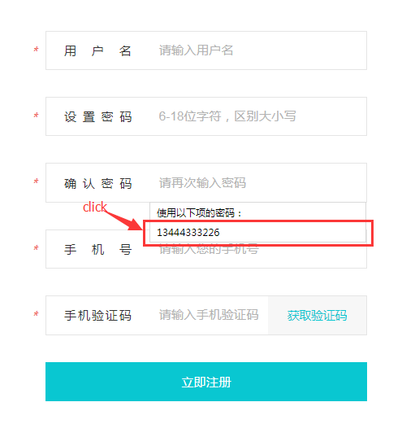
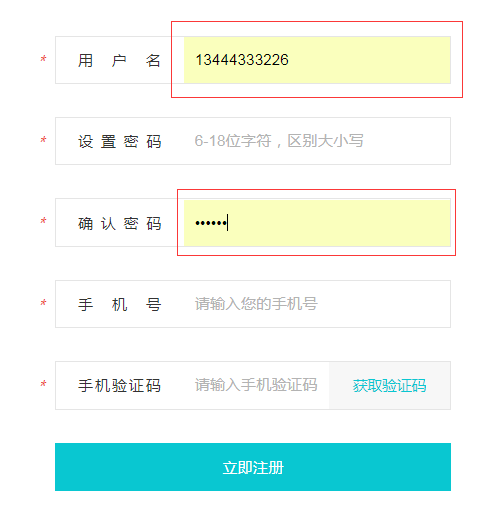
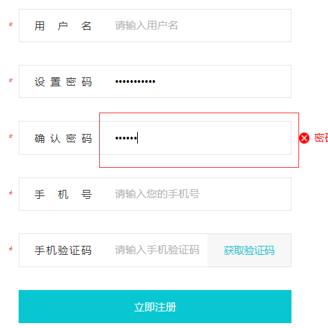

## input自动选择的背景色问题

在谷歌浏览器中`此问题只在chrome内核浏览器下会出现，其他浏览器没有`，自动选择input给出的联想的文本的话，Input的背景色会发生改变。以下的两张可以客观的展示效果。






现在要移除这不良的视觉体验。


**代码如下**

```css

input:-webkit-autofill{
  -webkit-box-shadow: 0 0 0 300px white inset;
}

```

**代码解析**

[参考](http://www.w3school.com.cn/cssref/pr_box-shadow.asp)

```bash

	box-shadow: h-shadow v-shadow blur spread color inset;


具体：

	h-shadow  必需。水平阴影的位置.允许负值

	v-shadow  必需。垂直阴影的位置。允许负值。

	blur  可选。模糊距离

	spread  可选。阴影的颜色。

	inset  可选。将外部阴影（outset）改成内部阴影。

```

这代码的实现其实不是屏蔽掉chrome浏览器默认添加的背景样式，而是使用文本框边框阴影遮住了背景颜色而已。样式中的300px即是阴影的宽度，当然，只要这个宽度大于背景颜色的区域即可(图片中的input宽度为232px)。效果如下图:


