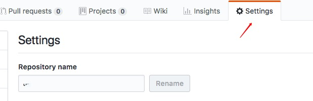
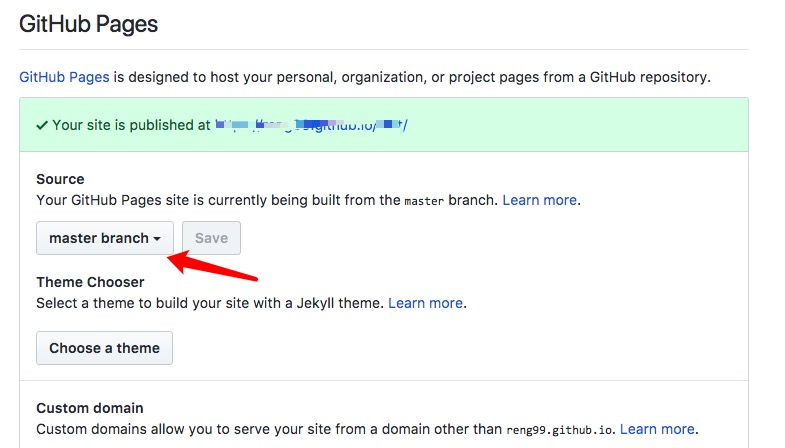

## username.github.io扩展pathname展示需要的仓库内容

> 前提条件

1. 你搭建好了自己的github page --> yourname.github.io

2. 新建另外一个仓库(我暂时命名为test),仓库根目录要有index.html入口

> 然后

在你需要扩展到yourname.github.io仓库的相关仓库（test）中按照下面的操作进行

1. 进入(test)参考的setting选项

2. 进入setting后，往下拉到github pages,修改source为`master branch`，点击保存即可

3. 打开 `yourname.github.io/test/ `就可以访问你新建test仓库的内容了